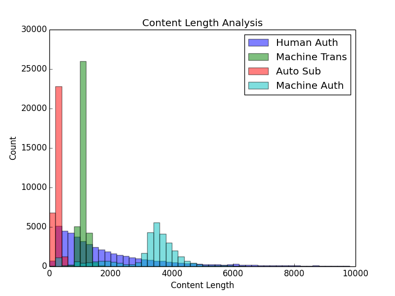

****

#	SMP EUPT 2018

****

##	Categories
-	[Abstract](#abstract)
-   [Set Up](#setup)
-   [Usage](#usage)
-   [Analysis](#analysis)
-   [Experiment](#exp)

****

##	<a name="abstract"> Abstract </a>

[SMP EUPT 2018](https://biendata.com/competition/smpeupt2018/)

****

##  <a name="setup"> Set Up </a>

```Shell
# python 2.7
python -m pip install numpy
python -m pip install scipy
python -m pip install enum34
python -m pip install ConfigParser
python -m pip install xgboost
python -m pip install scikit-learn
python -m pip install gensim
python -m pip install jieba
```

****

##	<a name="usage"> Usage </a>

```Shell
# Overall
python -m bin.go

# Builds a model
python -m bin.go --package bin.experiment.singlerun --object SingleRun

# Cross validation
python -m bin.go --package bin.experiment.cv --object CrossValidation
```

****

##	<a name="analysis"> Analysis </a>

### Content Length

| Label | Max   | Min   | Mean  |
| ----  | ----  | ----  | ----  |
| 人类作者 | 101487 | 105   | 2616  |
| 机器翻译 | 3382   | 371   | 1095  |
| 自动摘要 | 1443   | 65    | 254   |
| 机器作者 | 6971   | 0     | 3238  |



****

##	<a name="exp"> Experiment </a>

| Version               | Online    | Offline   | Note                  |
| ----                  | ------    | -------   | ----                  |
| v003                  | ------    | 0.85419   | add word_set_num      |
| v002                  | ------    | 0.80656   | add word_num          |
| v001                  | ------    | 0.79878   | add content_length    |